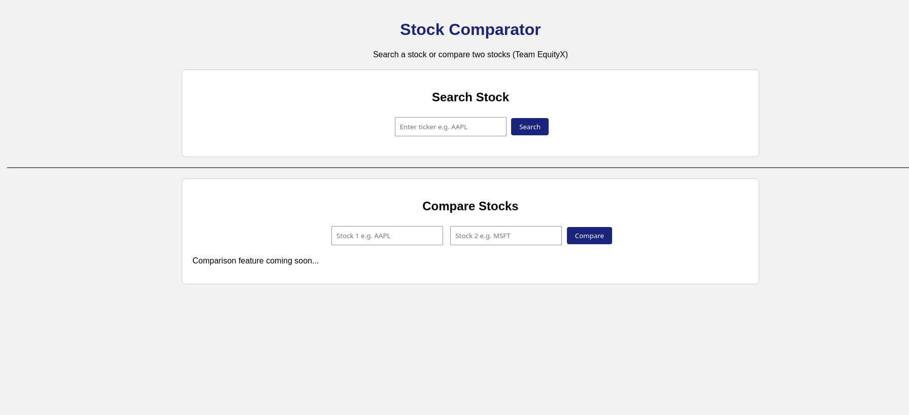

# Stock Comparator
A simple web app to search stocks and compare two stocks side-by-side using live market data. Built as a mini-project for Software Engineering.


 

---
## Tech Stack
- Frontend: HTML, CSS, JS
- Backend: Python, FastAPI
- Data: Twelve Data API

---
## How to run

Set up the backend

```bash
cd app
python -m venv .venv
source .venv/bin/activate
pip install -r requirements.txt
```

Add your API key

```bash
cp .env.example .env
```
paste your Twelve Data API key inside `.env`

Run the server

```bash
uvicorn main:app --reload
```

Open `frontend/index.html` in your browser.

---
## Structure

```stock-comparator-tree
Mini_project_Stock_comparator
├── app/
│   ├── main.c
│   ├── .env
│   └── .env.example
├── frontend/
│   ├── index.html
│   ├── style.css
│   └── script.js
├── requirements.txt
├── .gitignore
└── README.md
```

Backend fetches and processes data, frontend just displays it.

---
## Team
EquityX — Mini-Project I, Semester III

---
### License: MIT
